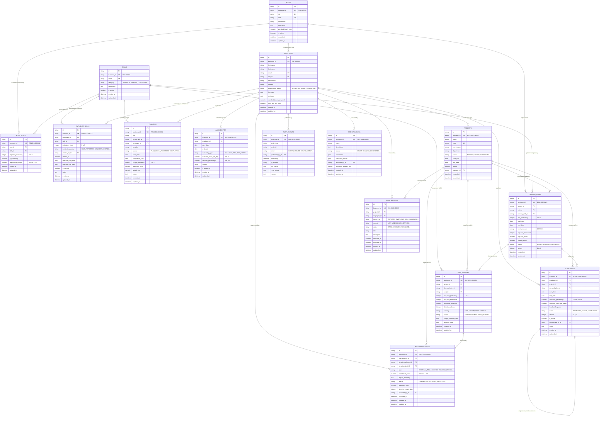

# WorkforceIQ Entity-Relationship Diagram (ERD)

This document visualizes the complete normalized relational data model for **WorkforceIQ** using Mermaid syntax.

```mermaid
erDiagram
    ROLES ||--o{ EMPLOYEES : "assigns primary role"
    ROLES ||--o{ ROLE_SKILLS : "mandates competency"
    ROLES ||--o{ DEMAND_PLANS : "requests role"

    SKILLS ||--o{ ROLE_SKILLS : "specified by role"
    SKILLS ||--o{ EMPLOYEE_SKILLS : "possessed by employee"
    SKILLS ||--o{ DEMAND_PLANS : "primary competency"
    SKILLS ||--o{ TRAININGS : "upskilling target"
    SKILLS ||--o{ GAP_ANALYSES : "competency deficit"

    EMPLOYEES ||--o{ EMPLOYEE_SKILLS : "demonstrates competency"
    EMPLOYEES ||--o{ ALLOCATIONS : "staffed to"
    EMPLOYEES ||--o{ AVAILABILITIES : "calendar capacity"
    EMPLOYEES ||--o{ TRAININGS : "enrolled in"
    EMPLOYEES ||--o{ PROJECTS : "leads/manages"
    EMPLOYEES ||--o{ RECOMMENDATIONS : "target candidate"
    EMPLOYEES ||--o{ ISSUE_RECORDS : "impacted by"
    EMPLOYEES ||--o{ AUDIT_EVENTS : "performed by"
    EMPLOYEES ||--o{ SCENARIO_RUNS : "executed by"

    PROJECTS ||--o{ DEMAND_PLANS : "contains demand lines"
    PROJECTS ||--o{ ALLOCATIONS : "receives staffing"
    PROJECTS ||--o{ GAP_ANALYSES : "identified deficits"
    PROJECTS ||--o{ ISSUE_RECORDS : "associated risks"
    PROJECTS ||--o{ RECOMMENDATIONS : "target initiative"

    DEMAND_PLANS ||--o{ ALLOCATIONS : "fulfilled by"
    DEMAND_PLANS ||--o{ GAP_ANALYSES : "shortage source"

    GAP_ANALYSES ||--o{ RECOMMENDATIONS : "resolved by"

    ALLOCATIONS ||--o| ALLOCATIONS : "supersedes previous revision"

    ROLES {
        string id PK
        string business_id UK "ROL-000001"
        string title UK
        string code UK
        string department
        text description
        numeric standard_hourly_rate
        boolean is_active
        datetime created_at
        datetime updated_at
    }

    SKILLS {
        string id PK
        string business_id UK "SKL-000001"
        string name UK
        string category "TECHNICAL, DOMAIN, LEADERSHIP..."
        text description
        boolean is_active
        datetime created_at
        datetime updated_at
    }

    EMPLOYEES {
        string id PK
        string business_id UK "EMP-000001"
        string first_name
        string last_name
        string email UK
        string role_id FK
        string department
        string location
        string employment_status "ACTIVE, ON_LEAVE, TERMINATED..."
        date hire_date
        date exit_date
        numeric standard_hours_per_week
        numeric cost_rate_per_hour
        datetime created_at
        datetime updated_at
    }

    EMPLOYEE_SKILLS {
        string id PK
        string business_id UK "EMPSKL-000001"
        string employee_id FK
        string skill_id FK
        integer proficiency_level "1 to 5"
        string verification_status "SELF_REPORTED, MANAGER_VERIFIED..."
        string verified_by_id FK
        datetime verified_at
        date effective_start_date
        date effective_end_date
        boolean is_current
        text notes
        datetime created_at
        datetime updated_at
    }

    ROLE_SKILLS {
        string id PK
        string business_id UK "ROLSKL-000001"
        string role_id FK
        string skill_id FK
        integer required_proficiency "1 to 5"
        boolean is_mandatory
        numeric importance_weight "0.00 to 1.00"
        datetime created_at
        datetime updated_at
    }

    PROJECTS {
        string id PK
        string business_id UK "PRJ-2026-000001"
        string name
        string code UK
        string client_name
        string department
        string status "PIPELINE, ACTIVE, COMPLETED..."
        date start_date
        date end_date
        numeric budget
        string manager_id FK
        datetime created_at
        datetime updated_at
    }

    DEMAND_PLANS {
        string id PK
        string business_id UK "DEM-<project-code>-2026W01"
        string project_id FK
        string role_id FK
        string primary_skill_id FK
        integer min_proficiency "1 to 5"
        date start_date
        date end_date
        string week_number "2026W01"
        integer required_headcount
        numeric required_hours
        numeric fulfilled_hours
        string status "DRAFT, APPROVED, FULFILLED..."
        integer priority "1 to 5"
        datetime created_at
        datetime updated_at
    }

    ALLOCATIONS {
        string id PK
        string business_id UK "ALLOC-2026-000001"
        string employee_id FK
        string project_id FK
        string demand_plan_id FK
        date start_date
        date end_date
        numeric allocation_percentage "0.00 to 100.00"
        numeric allocated_hours_per_week
        numeric hourly_billing_rate
        string status "PROPOSED, ACTIVE, COMPLETED..."
        integer version "1, 2, 3..."
        boolean is_active
        string superseded_by_id FK
        text notes
        datetime created_at
        datetime updated_at
    }

    AVAILABILITIES {
        string id PK
        string business_id UK "AVL-2026-000001"
        string employee_id FK
        date start_date
        date end_date
        string availability_type "AVAILABLE, PTO, SICK_LEAVE..."
        numeric available_hours_per_day "0 to 24"
        numeric capacity_percentage "0 to 100"
        string reason
        boolean is_approved
        datetime created_at
        datetime updated_at
    }

    TRAININGS {
        string id PK
        string business_id UK "TRN-2026-000001"
        string title
        string target_skill_id FK
        string employee_id FK
        string provider
        string status "PLANNED, IN_PROGRESS, COMPLETED..."
        date start_date
        date completion_date
        integer target_proficiency "1 to 5"
        numeric estimated_cost
        numeric actual_cost
        text notes
        datetime created_at
        datetime updated_at
    }

    GAP_ANALYSES {
        string id PK
        string business_id UK "GAP-2026-000001"
        string project_id FK
        string demand_plan_id FK
        string skill_id FK
        integer required_proficiency "1 to 5"
        integer required_headcount
        integer available_headcount
        integer deficit_headcount
        string severity "LOW, MEDIUM, HIGH, CRITICAL"
        string status "IDENTIFIED, MITIGATION_PLANNED..."
        date target_fulfillment_date
        date analysis_date
        datetime created_at
        datetime updated_at
    }

    RECOMMENDATIONS {
        string id PK
        string business_id UK "REC-2026-000001"
        string gap_analysis_id FK
        string target_employee_id FK
        string target_project_id FK
        string type "INTERNAL_REALLOCATION, TRAINING_UPSKILL..."
        numeric confidence_score "0.000 to 1.000"
        text impact_summary
        string status "GENERATED, ACCEPTED, REJECTED..."
        numeric estimated_cost
        integer time_to_impact_days
        string reviewed_by_id FK
        datetime reviewed_at
        datetime created_at
        datetime updated_at
    }

    SCENARIO_RUNS {
        string id PK
        string business_id UK "SCN-2026-000001"
        string name
        text description
        string status "DRAFT, RUNNING, COMPLETED..."
        json parameters
        json simulation_results
        string executed_by_id FK
        integer execution_duration_ms
        datetime created_at
        datetime updated_at
    }

    ISSUE_RECORDS {
        string id PK
        string business_id UK "ISS-2026-000001"
        string project_id FK
        string employee_id FK
        string issue_type "CAPACITY_OVERLOAD, SKILL_SHORTAGE..."
        string severity "LOW, MEDIUM, HIGH, CRITICAL"
        string status "OPEN, MITIGATED, RESOLVED..."
        string title
        text description
        datetime detected_at
        datetime resolved_at
        datetime created_at
        datetime updated_at
    }

    AUDIT_EVENTS {
        string id PK
        string business_id UK "AUD-2026-000001"
        string entity_type
        string entity_id
        string action "INSERT, UPDATE, DELETE, VERIFY..."
        string performed_by_id FK
        datetime timestamp
        string ip_address
        json old_values
        json new_values
        text reason
    }
```

